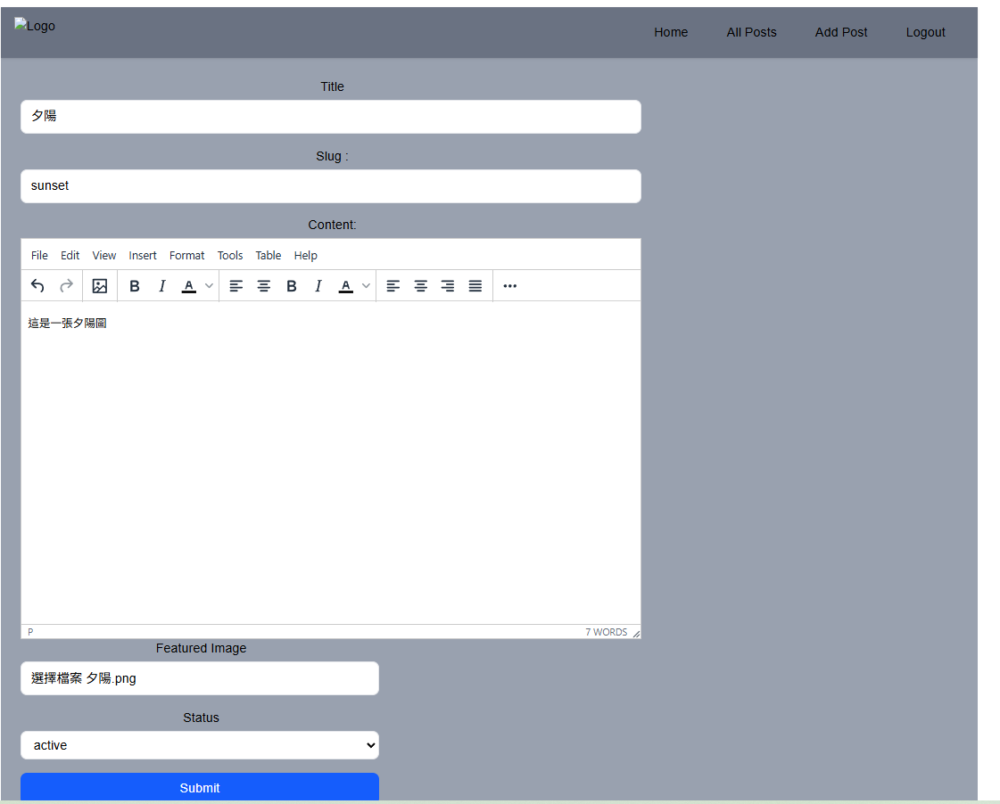
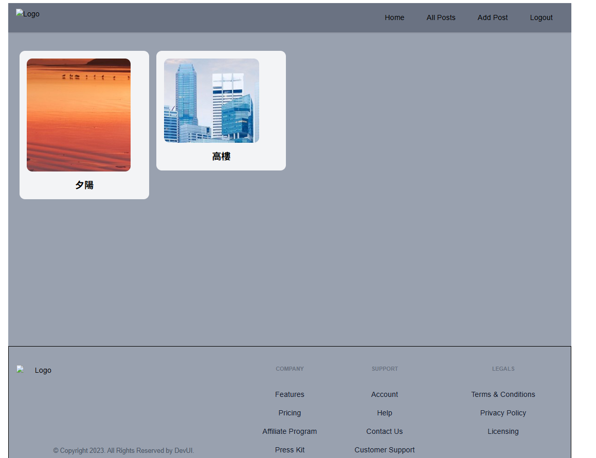
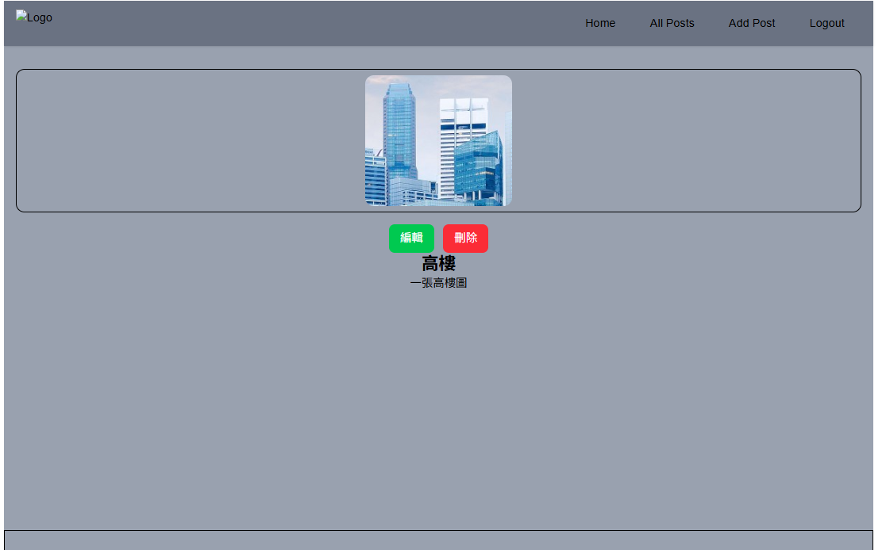

# blog-side-project 

> 使用 React + Vite + Tailwind CSS + Appwrite 打造的簡易部落格系統，具備註冊、登入、發文、刪除、圖片上傳功能。

---
##  功能

- 使用者註冊與登入（基於 Appwrite Auth）
- 發布與刪除貼文（支援圖片）
- 圖片儲存整合 Appwrite Storage
- React 建構的現代化前端介面

---
## 展示





---
##  資料流程說明

1.使用者登入/註冊流程

- 經由 components/Login.jsx、Signup.jsx 送出表單，透過 appwrite/auth.js 呼叫 Appwrite 的 account.createEmailSession() 或 account.create()

- 成功登入後，使用者資訊會儲存在 store/authSlice.js 中，並透過 context 傳遞給全域元件。


2.文章操作

- 新增／編輯文章使用 PostForm.jsx，送出資料由 appwrite/database.js 處理 Appwrite 資料庫操作。

- 每篇文章內含：標題、內容（由 RTE.jsx 提供 rich text 編輯器）、封面圖（經 appwrite/storage.js 上傳後取得圖片 URL）。

- 所有文章頁（allpost.jsx）與單篇文章頁（post.jsx）皆透過資料庫查詢取得內容並渲染。

3.前端路由與權限控制

- pages/ 目錄下各頁面組合功能元件，並以 AuthLayout.jsx 限制特定頁面（如 addpost, editpost）需登入後才能訪問。

4.錯誤處理與 UI 統一

- 所有 Appwrite 操作錯誤集中由 errorHandler.js 處理，並適當顯示於介面中。

- 常用 UI 元件如 Button.jsx、Input.jsx、Select.jsx 可重複使用以維持風格一致性。

---
##  快速開始
保護個人 Appwrite憑證，未隨專案上傳 .env。
不過仍可完整瀏覽本專案的資料流、元件架構與畫面互動邏輯，理解整體技術設計流程。
若需本地完整體驗，請自行至Appwrite官網申請帳號並參考官方文件。

```bash
npm run dev
```
---
##  已知問題&待新增項目
- 編輯文章 
- 語言切換 深色模式
